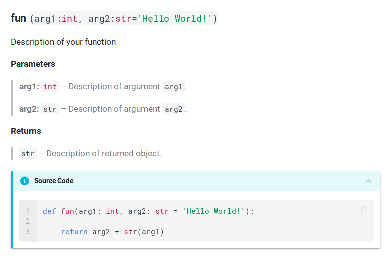

# Welcome to AutoMacDoc

## What is AutoMacDoc?
AutoMacDoc is a tool to generate documentation for Python modules or groups
of functions. It is based on [MkDocs](https://mkdocs.org) and written in [Python](https://python.org).

## Why this project?
To keep it simple:
 - The best tool to auto generate a doc is Sphinx but it is complicated and it uses reStructuredText.
 - reStructuredText sucks, MarkDown rocks!
 - MkDocs is an amazing tool to generate a website with MarkDown.
 - We lack a tool to transform a folder of code into a nice and clean MkDocs project

## How to install ?
With pip pardi : `pip install automacdoc`

## Recipe to make it works!
  - Ingredients:
    - a folder with some python codes inside (like the folder `example` here)
    - nice and well documented functions inside this code

  - Easy steps:
    - install automacdoc
    - open a terminal and type `automacdoc example/src example`


## How is works ?
AutoMacDoc list all your python functions and class in the folder (in `example/src` here) and generate doc about it (in `example` here)!
It creates:
  - a 'docs' folder that contains the documentation in markdown (see [MkDocs](https://mkdocs.org) for more details)
  - a 'site' folder that contains the static sitePP
  - a 'mkdocs.yml' file that in the config file for mkdocs (see [MkDocs](https://mkdocs.org) for more details)

## Minimal project layout

  - before AutoMacDoc:

>      src/
>          ...         # Other python files or folders

  - after AutoMacDoc:

>      mkdocs.yml      # The configuration file.
>
>      src/
>          ...         # Other python files or folders
>
>      docs/
>          index.md    # The documentation homepage.
>          ...         # Other markdown pages, images and other files.
>
>      site/           # The static site ready to be hosted
>          index.html
>          ...


## Recommended Docstring
**Code:**
```py3
def fun(arg1: int, arg2: str = 'Hello World!'):
    """Description of your function

    **Parameters**

    > **arg1:** `int` -- Description of argument `arg1`.

    > **arg2:** `str` -- Description of argument `arg2`.

    **Returns**

    > `str` -- Description of returned object.
    """
    return arg2 + str(arg1)
```

**Screenshot:**




## You want more ?
Check the example folder, you will found tons of fancy elements you can now add to your documentation.
